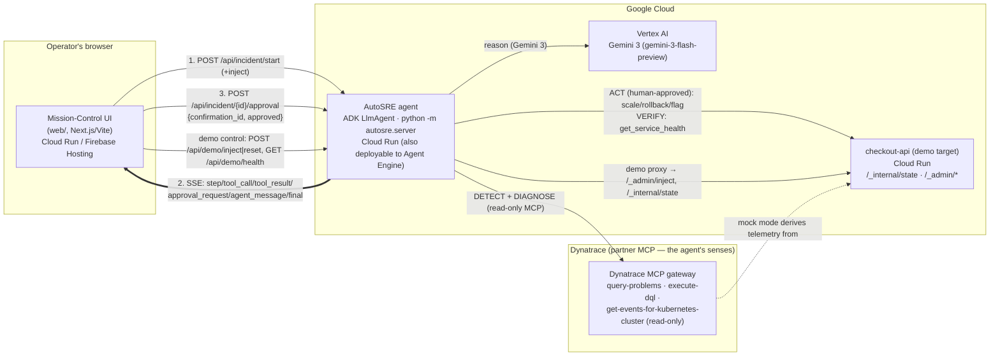

# ARCHITECTURE.md — AutoSRE deploy topology

**Status: LOCKED (2026-05-28).** Canonical deploy topology for the live hosted URL.
Owned for implementation by Workstream C (`deploy/`). Consumed by all workstreams for
service names, origins, and env-var names. The streaming wire format between the UI and
the agent is defined in `CONTRACT.md`.

> **Implementation note (current).** As built and deployed: the agent container runs a
> self-hosted FastAPI app (`python -m autosre.server`, ADK `InMemoryRunner`) on Cloud Run,
> not `adk api_server`. The same ADK `root_agent` is also deployable to Vertex AI Agent
> Engine via `deploy/agent_engine_deploy.py` (it wraps the agent in an `AdkApp` and calls
> `agent_engines.create`); the live hosted demo runs on Cloud Run, and Agent Engine is the
> managed-runtime option, not the present hosting of the demo URL. The code/Dockerfile
> default model is `gemini-3-flash-preview` (`gemini-3-pro-preview` is an opt-in via
> `AUTOSRE_MODEL` where it is allowlisted). The Dynatrace tools are snake_case per
> `@dynatrace-oss/dynatrace-mcp-server` v1.8.6 (`list_problems`/`query_problems` in mock,
> `execute_dql`, `get_kubernetes_events`, `list_vulnerabilities`), so the kebab-case names
> in the diagram below are the original design only. The topology itself (Cloud Run
> services, CORS, env vars) is exactly as described.

---

## 1. One-line summary

AutoSRE is an autonomous incident-response agent built with the **Agent Development Kit
(ADK)**, the code-first surface of **Google Cloud's Agent Platform (Agent Builder)**,
**reasoning on Gemini 3 via Vertex AI**, and **deployed on Cloud Run** (the same ADK
`root_agent` is also deployable to **Vertex AI Agent Engine**, Google Cloud's managed
Agent Platform runtime, via `deploy/agent_engine_deploy.py`). It uses the **Dynatrace
MCP** as its only sensory system (detect + diagnose) and a human-gated set of remediation
tools to act on a demo `checkout-api` service. A web "Mission Control" UI streams the
whole loop live.

> Wording note (scoring point — use verbatim in README/video): *"AutoSRE is built with
> the Agent Development Kit, the code-first surface of Google Cloud's Agent Platform
> (Agent Builder), reasoning on Gemini 3 via Vertex AI, deployed on Cloud Run, and also
> deployable to Vertex AI Agent Engine."* ADK is the code-first surface of Agent Builder;
> state this explicitly so a Google DevRel judge ticks the box rather than having to
> infer it. Genuine Gemini 3 plus genuine ADK on Vertex AI is what clears the eligibility
> gate, independent of which runtime hosts the demo URL.

---

## 2. Services & hosting

| Service | What it is | Host | Public? | Source |
|---|---|---|---|---|
| **AutoSRE agent** | ADK `LlmAgent` (Gemini 3 via Vertex), served over HTTP by the self-hosted FastAPI app `python -m autosre.server` (ADK `InMemoryRunner`). Emits the SSE stream + approval/demo endpoints per `CONTRACT.md`. The same ADK `root_agent` is also deployable to **Vertex AI Agent Engine** via `deploy/agent_engine_deploy.py`. | **Cloud Run** (hosts the live demo); **Vertex AI Agent Engine** is the managed-runtime option | Yes (CORS-restricted to UI origin) | `autosre/`, `deploy/Dockerfile.agent`, `deploy/agent_engine_deploy.py` |
| **checkout-api** | Demo target service the agent observes and remediates; exposes `/checkout`, `/healthz`, `/_internal/state`, `/_admin/*`. | **Cloud Run** | Internal/agent-only (the agent and demo-control proxy reach it server-side) | `autosre/target_service/`, `deploy/Dockerfile.target` |
| **Mission-Control UI** | The web war-room app that streams the agent loop and renders the APPROVE/REJECT moment. | **Cloud Run** (containerized Next.js/Vite) **or Firebase Hosting** | Yes — **this is the public submission URL** | `web/` |
| **Dynatrace MCP** | Observability source (Davis problems, DQL). `remote` = tenant gateway; `mock`/`stdio` = local. The agent's senses. | External (Dynatrace tenant) or in-process mock | n/a | partner / `autosre/mock_dynatrace/` |

The **single public URL** judges click is the **Mission-Control UI**. It talks to the
agent's Cloud Run origin over SSE (`CONTRACT.md` §1). `checkout-api` need not be public:
the agent (remediation tools) and the agent's demo-control proxy reach it server-to-
server via `TARGET_SERVICE_URL`.

---

## 3. Data flow

Flow in words:
1. UI starts a sweep (optionally injecting a fault). The agent runs the
   DETECT → DIAGNOSE → ACT → VERIFY loop from `autosre/agent/agent.py`.
2. The agent reads observability **only** from the Dynatrace MCP (read-only tool
   filter, `autosre/agent/dynatrace.py:27-34`) and reasons on Gemini 3 via Vertex.
3. At ACT, ADK pauses for human approval (`require_confirmation=True`); the agent
   streams an `approval_request`; the UI blocks until the operator decides; the
   decision round-trips per `CONTRACT.md` §3; the approved remediation then mutates
   `checkout-api`.
4. VERIFY reads `checkout-api` health; the UI flips the incident card green on recovery.

---

## 4. CORS

The UI origin and the agent origin are **different** Cloud Run domains, so the agent
MUST send CORS headers permitting the UI:

- `Access-Control-Allow-Origin: <UI origin>` (e.g. `https://autosre-ui-xxxx.run.app`,
  or the Firebase Hosting domain). Prefer an explicit allow-list env var, not `*`,
  because SSE + credentials and a known origin are cleaner; `*` is acceptable for the
  demo if no credentials are sent.
- `Access-Control-Allow-Methods: GET, POST, OPTIONS`
- `Access-Control-Allow-Headers: Content-Type`
- Handle `OPTIONS` preflight for the POST endpoints (`/api/incident/start`,
  `/api/incident/{id}/approval`, `/api/demo/inject`, `/api/demo/reset`).
- SSE note: `text/event-stream` responses also need the `Allow-Origin` header on the
  `GET .../stream` response itself, not just preflight.

The agent reads the allowed UI origin from `ALLOWED_ORIGIN` (see §5).

---

## 5. Environment variables per service (names only — never commit values)

`.env` is gitignored; secrets come from the environment / Google Secret Manager on
Cloud Run. Names below match the existing code (`autosre/agent/agent.py`,
`autosre/agent/dynatrace.py`, `autosre/agent/remediation.py`,
`deploy/deploy_cloud_run.sh`) and `.env.example`.

### AutoSRE agent (Cloud Run; same agent also registerable on Vertex AI Agent Engine)
| Env var | Purpose |
|---|---|
| `GOOGLE_GENAI_USE_VERTEXAI` | `TRUE` — route Gemini reasoning through Vertex AI (not AI-Studio key). |
| `GOOGLE_CLOUD_PROJECT` | GCP project id for Vertex / Agent Engine. |
| `GOOGLE_CLOUD_LOCATION` | Vertex region, e.g. `us-central1`. |
| `AUTOSRE_MODEL` | Model id; default `gemini-3-flash-preview` (read at import in `agent.py`). `gemini-3-pro-preview` is an opt-in where pro is allowlisted. |
| `DYNATRACE_MCP_MODE` | `mock` \| `stdio` \| `remote` (read in `dynatrace.py`). |
| `DT_ENVIRONMENT` | Dynatrace tenant base URL (remote/stdio). **Secret-ish; from env/Secret Manager.** |
| `DT_PLATFORM_TOKEN` | Dynatrace platform token (remote/stdio). **SECRET — Secret Manager only.** |
| `OTEL_EXPORTER_OTLP_ENDPOINT` / `OTEL_EXPORTER_OTLP_HEADERS` | Dynatrace OTLP ingest config; when set, enables the approval write-back to the tenant (Log Monitoring API v2). **Token in headers is SECRET.** |
| `TARGET_SERVICE_URL` | The deployed `checkout-api` URL (read in `remediation.py`); also used by the demo-control proxy and `mock` MCP server. |
| `ALLOWED_ORIGIN` | UI origin allowed for CORS (§4). |
| `PORT` | Provided by Cloud Run; `python -m autosre.server` (uvicorn) binds it (`deploy/Dockerfile.agent`). |

> Auth to Vertex on Cloud Run uses the service's runtime service account
> (Application Default Credentials), not a key file. No `GOOGLE_API_KEY` in prod.

### checkout-api (Cloud Run)
| Env var | Purpose |
|---|---|
| `PORT` | Provided by Cloud Run (`uvicorn` binds it). |

(No secrets. It is a self-contained demo service.)

### Mission-Control UI (Cloud Run / Firebase Hosting)
| Env var | Purpose |
|---|---|
| `NEXT_PUBLIC_AGENT_BASE_URL` (or `VITE_AGENT_BASE_URL`) | The agent's Cloud Run origin the UI streams from (base for all `CONTRACT.md` endpoints). Public/build-time. |

### Dynatrace MCP token scopes (when `remote`/`stdio`)
`mcp-gateway:servers:invoke`, `mcp-gateway:servers:read`, `storage:logs:read`,
`storage:metrics:read`, `storage:events:read`.

---

## 6. Deploy notes (for Workstream C)

- Extend `deploy/deploy_cloud_run.sh` (already deploys `checkout-api` then the agent and
  wires the agent's env incl. `TARGET_SERVICE_URL`) to also deploy `web/` and to set
  `ALLOWED_ORIGIN` on the agent = the deployed UI origin, and the UI's
  `*_AGENT_BASE_URL` = the deployed agent origin. (Two-pass or capture-then-set, since
  each needs the other's URL.)
- The agent container (`deploy/Dockerfile.agent`) runs the self-hosted FastAPI app
  `python -m autosre.server` on `$PORT` (ADK `InMemoryRunner`); it serves the SSE stream,
  the approval round-trip, and the demo-control proxy per `CONTRACT.md` §6.
- The "Agent Platform" scoring hook is genuine ADK on Gemini 3 via Vertex AI. To also
  make the "deployed on Vertex AI Agent Engine" claim literally true, run
  `python -m deploy.agent_engine_deploy` to register the ADK `root_agent` on Agent Engine
  and paste the printed resource name into `SUBMISSION.md`/README.
- The final public URL (the UI) goes in `SUBMISSION.md`; it must work from an incognito
  window on a cold load (Stage-1 requirement).
- Required GCP APIs (already in the deploy-script preamble): `run.googleapis.com`,
  `aiplatform.googleapis.com`, `cloudbuild.googleapis.com`.

---

## 7. Mode-agnostic guarantee

The topology is identical regardless of `DYNATRACE_MCP_MODE`. `remote` points the agent
at the tenant MCP gateway; `mock` runs the bundled MCP server in-process (it derives
telemetry from `checkout-api`'s `/_internal/state`). The UI, the contract, and every
other service are unchanged. For the demo, detect/diagnose may run `remote` (credibility)
while act/verify runs `mock` (reliability) — purely an env choice on the agent service.
