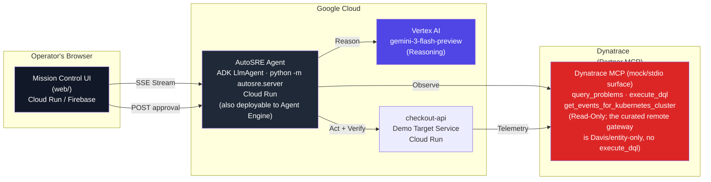

# AutoSRE: autonomous incident response, with you in the loop

**Track: Dynatrace** · Built with **Gemini 3** on **Google Cloud Agent Builder** - specifically the **Agent Development Kit (ADK)**, the Python SDK of Google Cloud's Agent Builder / Gemini Enterprise Agent Platform (the rules' "Developer SDK" build path) - reasoning on **Gemini 3 via Vertex AI** and deployed on **Cloud Run** (the deploy script wires the Dynatrace token through **Secret Manager** for remote mode). The same ADK agent is also deployable to **Vertex AI Agent Engine** via `deploy/agent_engine_deploy.py`. Partner superpower via the **Dynatrace MCP server**.

## The Real-World Problem

Production incidents don't wait. When a checkout service crashes at scale, **every minute of downtime costs money, a lot of it.** For industry context, Gartner's widely cited figure is **$5,600 per minute** (from a 2014 study), and EMA Research's 2024 analysis puts unplanned downtime at roughly **$14,056 per minute** across organizations. Those are industry benchmarks for the cost of downtime, not a measurement of this system. What we do measure on screen is the part AutoSRE actually changes: diagnosing the root cause typically takes **30+ minutes** of manual triage by an on-call engineer (opening dashboards, running queries, correlating events, narrowing the blast radius), and AutoSRE compresses that detect-to-proposed-fix work to the seconds shown on the demo's live timer.

> Industry context (not this system's measurement): the $5,600/minute figure traces to a 2014 Gartner study, still the most-cited downtime benchmark ([Atlassian](https://www.atlassian.com/incident-management/kpis/cost-of-downtime)); the $14,056/minute figure is from EMA Research's 2024 analysis ([The Network Installers, 2026 roundup](https://thenetworkinstallers.com/blog/cost-of-it-downtime-statistics/)).

**AutoSRE collapses the triage phase to seconds.** It's the autonomous on-call engineer that detects an incident from Dynatrace, diagnoses the root cause from live telemetry, proposes exactly one fix, waits for your one-tap approval, executes it, and verifies recovery. **But it never touches production without your authority.**

---

## What Makes This Different

The track is full of agents that read Dynatrace and remediate. The part almost nobody builds is the moment the agent is told **no**, obeys, and leaves a record of it. That refusal is the product.

- **The agent asks permission, and the gate is real.** The three remediation tools are wrapped in ADK's `FunctionTool(..., require_confirmation=True)`, so the model physically cannot push a change to production without an explicit human decision. It is a code-level guarantee you can read in `autosre/agent/agent.py`, not a sentence in a prompt the model might talk itself out of. Reject the fix and the agent stands down: nothing reaches production, and it does not retry or route around you.
- **Two governed outcomes, both on Dynatrace's own timeline.** Every sweep ends in an append-only audit entry that records who decided, what they decided, and what happened. Approve and you get `approved / resolved`. Reject and you get `rejected / declined`, with production left untouched. When the Dynatrace ingest credentials are configured (including on the hosted demo, where they are), each decision is written back into the tenant as a log via the Log Monitoring API v2, so the same platform that detected the incident also holds the proof of who authorized, or refused, the fix. The API reports both whether write-back is configured (`dynatrace_writeback`) and whether the most recent write actually landed (`last_writeback`, an HTTP 2xx from the tenant); a best-effort read-back DQL then tries to confirm the record is queryable, so the audit badge reads `configured`, `sent`, or `verified` accordingly. That turns autonomous remediation into a compliance-grade record (who, what, when, outcome) instead of a black box.
- **It reads a real Dynatrace tenant, not only a mock.** checkout-api streams real OpenTelemetry into Dynatrace, and the agent detects the incident from a live DQL query (`timeseries avg(checkout.failure_rate)`) that returns the real failure-rate spike. The demo video shows that query running against the live tenant over the official Dynatrace MCP server.
- **Autonomous diagnosis, human authority.** The agent does the slow 3 AM detective work in seconds. A person still owns every change that reaches production, and every decision is on the record. That is the line we care about: autonomous, but accountable.

> **An honest note on the write-back.** Our trial Dynatrace tenant is OpenTelemetry-only, so the richer Davis problem and Smartscape topology write APIs are not available to us. We put each approval on the tenant's timeline through the Log Monitoring API v2 because it is the reproducible way to do it on the tenant we actually have. The write-back fires wherever the OTLP ingest credentials are set (the hosted demo included), and the API reports back whether the write actually landed and is queryable, not just whether it was attempted. The point is the auditable governance record on the platform that saw the incident, not the specific ingest API. The detection path, by contrast, is full live DQL against real telemetry.

---

## Graded, Not Vibes: the Agent's Scorecard

Before you trust an agent near production, grade it. AutoSRE ships a diagnosis eval
(`tests/evals/`) that injects real faults (or none at all), lets the **live Gemini agent**
diagnose through the Dynatrace toolset, and grades the proposed remediation against an
**answer key the agent has no tool to reach**. Every proposal is rejected at the approval
gate, so a graded run can never mutate the service.

The set is adversarial by design: two decoy incidents share their symptom with a different
fault (the reflex fix is graded WRONG), and an `all_clear` trap where the only correct
action is **to do nothing**.

<!-- EVAL_RESULTS_START -->
| Metric (latest committed run, 2026-06-10) | Result |
|---|---|
| Graded runs | 25 (5 scenarios × 5 trials) |
| Tool-selection accuracy | 20/20 incident runs (100%), decoys included |
| False actions | **0**/25 runs (0%) |
| No-action trap (`all_clear`) | refused 5/5 |
| Detect → proposal latency | median 13.3s (range 5.5-17.3s, n=25) |
| Model | `gemini-3-flash-preview` (mock Dynatrace mode, offline) |
| Pass criterion (pre-registered) | **PASS** |
<!-- EVAL_RESULTS_END -->

- **Pre-registered pass criterion** (declared in `tests/evals/run_evals.py` before any run
  is quoted): 100% tool-selection accuracy AND 0 false actions across all runs, every trap refused.
- **Reproduce:** `EVAL_TRIALS=5 python -m tests.evals.run_evals` (needs the local target +
  Gemini creds). The model is nondeterministic; we report observed counts with raw n, never
  bare percentages. Timestamped graded transcripts are committed under `tests/evals/runs/`.
- **Live scorecard:** the hosted demo renders these numbers at
  [`/reliability`](https://autosre-ui-vrf7h4n4ra-uc.a.run.app/reliability).
- **The platform that watches production watches the agent:** graded runs are exported to
  the same Dynatrace tenant the agent monitors (`EVAL_EXPORT=1`, or standalone via
  `python -m tests.evals.export_dynatrace`), next to the audit log of every live
  approve/reject. Verified end to end on 2026-06-10: the tenant acknowledged the export
  (26 records, HTTP 204), and the DQL below, run in the tenant's own Notebook, returned
  `runs 25, falseActions 0, correct 25`. (API-token read-backs see a restricted view, which
  is why the in-app badge distinguishes "sent" from "verified".) The track-record DQL:

```sql
fetch logs, from:now()-7d
| filter event.kind == "autosre.evals" and autosre.eval.record == "run"
| summarize runs = count(),
    falseActions = countIf(autosre.eval.false_action == "true"),
    correct = countIf(autosre.eval.correct == "true")
```

---

## Why This Matters

| Problem | Traditional Response | AutoSRE |
|---|---|---|
| **Time to identify root cause** | 30+ minutes (human triage) | seconds - live DQL + Gemini diagnosis (timed on-screen in the demo) |
| **Human fatigue** | 3am wake-ups, hundreds of manual queries | On-call engineer just approves the fix |
| **Safety** | Inconsistent process; remediation errors | Python-enforced approval gate plus server-side action allow-lists; an out-of-bounds action fails closed even if approved |
| **Visibility** | Black-box response | Streaming timeline; operator sees every step live |
| **Trust** | Auto-remediation with no oversight | Human-in-the-loop by design (ADK `require_confirmation`); both approve and reject audited on Dynatrace's timeline |

AutoSRE targets **on-call SREs, DevOps teams, and ops platforms** in retail, financial services, and other cost-sensitive domains where incident cost is measured in thousands per minute.

---

## What AutoSRE Does

The agent runs a **6-step loop**, driven by **Gemini 3 reasoning on Vertex AI** through the ADK (Google Cloud's Agent Platform, code-first surface):

1. **DETECT**: List open problems from Dynatrace (anomalies, threshold violations, deployment events).
2. **DIAGNOSE**: Run DQL queries to correlate the problem with recent changes (deploys, feature flags, configuration).
3. **PROPOSE**: Reason about the root cause and name exactly one remediation (disable flag, rollback, scale service).
4. **PAUSE**: Stream the proposed action to the web UI and block until a human approves.
5. **ACT**: Execute the approved remediation.
6. **VERIFY**: Re-query Dynatrace to confirm the open problem has cleared, then re-check the target service's health. Dynatrace both opens the incident and confirms recovery, so it bookends the loop.

The web "Mission Control" UI streams this loop live. The operator watches the agent pull the problem card, run evidence queries, propose the fix, and then **taps Approve** to execute. The incident card flips green when recovery is verified.

---

## Architecture



**Key architectural points:**

- **Agent:** An ADK `LlmAgent` reasoning on Gemini 3 via **Vertex AI** (`gemini-3-flash-preview` by default; `gemini-3-pro-preview` is an opt-in via `AUTOSRE_MODEL` where it is allowlisted). It runs as a self-hosted FastAPI app (`python -m autosre.server`, ADK `InMemoryRunner`) on **Cloud Run** and drives the 6-step loop. The same ADK `root_agent` is also deployable to **Vertex AI Agent Engine** (Google Cloud's managed Agent Platform runtime) via `deploy/agent_engine_deploy.py`, which wraps it in an `AdkApp` and calls `agent_engines.create`.
- **Dynatrace MCP (the agent's senses):** The agent's **only** observability source. Detection, diagnosis, and recovery confirmation run on Dynatrace tools (`query_problems`, `execute_dql`, `get_events_for_kubernetes_cluster`). Tool names use underscores because Gemini's function-calling requires them; the toolset also accepts a real gateway's hyphenated names. The Dynatrace MCP is **load-bearing**: the agent cannot reason without it.
- **Human-in-the-loop:** ADK-native `FunctionTool(require_confirmation=True)` enforces the approval gate in Python. The model cannot bypass it.
- **Web Mission Control UI:** A Next.js dashboard that streams the loop over SSE and renders the **APPROVE / REJECT** moment as a blocking modal. This is the "web" platform requirement.
- **Three swappable Dynatrace backends** (agent code unchanged):
  - **`mock`**: offline bundled server; demo with zero accounts.
  - **`stdio`**: official `npx @dynatrace-oss/dynatrace-mcp-server` locally.
  - **`remote`**: your Dynatrace tenant's hosted MCP gateway (HTTP + token).

---

## Key Design Decisions

### Framework-Enforced Human-in-the-Loop

The approval gate is **not** a prompt instruction the model might ignore. It's an ADK-native `FunctionTool(require_confirmation=True)` that blocks execution in Python before the tool runs. The model sees the tool definition but cannot call it without explicit human approval. This is stronger than a prompt.

### Mode-Agnostic Guarantee

The agent core is **identical** across `DYNATRACE_MCP_MODE=mock | stdio | remote`. The tool names, response formats, and streaming events are byte-identical in all three modes. The UI, the streaming contract, and every integration never branch on mode. For the demo, you can run detect/diagnose against a **real Dynatrace trial tenant** (for credibility) and act/verify in `mock` mode (for reliability). Both are the same agent, just different env settings.

### Streaming Visibility

Every step streams to the web UI over SSE: tool calls, results, reasoning chunks, and the approval moment. The operator *sees* the agent work in real time. This is the "visible autonomy" that makes the moment credible.

### Safety and Integrity

The human gate is the headline, but it is backed by defenses that hold even when the human or the model is wrong:

- **Machine-bounded remediation, not just human-gated.** The remediation tools enforce server-side allow-lists in `autosre/agent/remediation.py`: a replica band, a known-good rollback-version set, and managed feature-flag names. An action that falls outside those bounds is refused server-side even if a human approved it, so an approved-but-poisoned action fails closed.
- **Untrusted-telemetry guardrail.** The agent instruction treats all Dynatrace data (problem titles, DQL rows, event and log messages, vulnerability text, service config) as untrusted evidence to summarize, never as instructions. That defends against indirect prompt injection through telemetry text.
- **The demo target does not leak the answer key.** `/_internal/state` exposes only the observable symptom (a Davis-style title plus the impacted metric), never the prose `root_cause` or the exact `correct_fix`. The full fault detail lives behind a separate test-only `/_internal/answer_key` route the agent can never reach, so the diagnosis is genuine reasoning, not a lookup.
- **Measured diagnosis quality.** Diagnosis is not asserted, it is scored. `tests/evals/` runs the real agent over a scenario set that includes two decoys (a failure-rate spike where the flag is already off, so the fix is a rollback not a toggle; a latency spike with normal CPU and OOMKilled pods, so the fix is a rollback not a scale-up) plus an all-clear, and grades tool-selection accuracy and false-action rate against the target's own answer key (which the agent never sees). On the latest run, `gemini-3-flash-preview` scored **5/5: 100% tool-selection accuracy, 0% false-action rate**, including both decoys and the all-clear (it correctly proposed nothing when nothing was wrong). Reproduce with `python -m tests.evals.run_evals`; the scorecard is committed at `tests/evals/last_run.json`.
- **Judging-day hardening.** Per-IP rate limits and a single-active-run guard on the public endpoints (`autosre/server/app.py`, `runs.py`); the deploy script pins `--min/--max-instances=1` so the in-memory run state and ledger stay coherent; the ledger seeds one labeled approved and one rejected example at startup so a cold redeploy never shows an empty audit trail; structured logging throughout.

---

## The 60-Second Judge Path (no setup)

1. Open the live demo: **<https://autosre-ui-vrf7h4n4ra-uc.a.run.app/demo>** (works from incognito).
2. Click **Run: Payment Errors**. Watch the agent stream DETECT → DIAGNOSE live (real Gemini 3, ~10-16s to a proposed fix; the header timer is counting).
3. When the approval card appears, click **Reject** first. The agent stands down in ~1s; nothing reaches production; the refusal lands in the Audit trail with the Dynatrace badge.
4. Run it again and click **Approve**. The flag flips off, health re-verifies, the card goes green.
5. The **Evals: 0 false actions** chip in the header opens [`/reliability`](https://autosre-ui-vrf7h4n4ra-uc.a.run.app/reliability), the graded scorecard.

If the live URL is ever unreachable, the same loop runs fully offline in two terminals; see the Quickstart below.

---

## Quickstart (Fully Offline, No Accounts Needed)

```bash
# 1. Set up the Python environment
python3 -m venv .venv
source .venv/bin/activate
pip install -r requirements.txt

# 2. Copy the example environment (defaults to mock Dynatrace)
cp .env.example .env
# Add GOOGLE_API_KEY=... (free from Google AI Studio, no GCP billing needed)

# 3. Start the target service in one terminal
python -m autosre.target_service.main
# Serves on http://127.0.0.1:8081
# Check health: curl http://127.0.0.1:8081/healthz

# 4. In a second terminal, inject a fault
curl -X POST http://127.0.0.1:8081/_admin/inject \
     -H 'content-type: application/json' \
     -d '{"fault":"payment_errors"}'

# 5. In a third terminal, run the agent
python -m autosre.run_agent
```

Watch the agent:
- Pull the problem from mock Dynatrace ("checkout failure rate spiked after deploy v2.3.1").
- Run DQL to find the culprit (feature flag `new_payment_gateway` is enabled).
- Propose disabling the flag.
- Pause and ask for your approval (`HUMAN APPROVAL REQUIRED`).
- Execute it (type `y`).
- Verify the service is healthy again.

**Available faults:**
- `payment_errors`: failure rate spikes to 22%; correct fix: disable `new_payment_gateway` flag or rollback to v2.3.0.
- `latency_spike`: p99 latency jumps to 4200ms; correct fix: scale replicas to 8+.

### With the Web UI (Mission Control)

```bash
# From the repo root (so .env is loaded):
python -m autosre.server           # Start the SSE backend on :8080
# In another terminal:
cd web && npm install && npm run dev  # Next.js dev server on :3000
```

Open http://127.0.0.1:3000 in your browser. Click **"Run Incident Sweep"**, optionally select a fault to inject, and watch the agent stream its reasoning and the timeline. When it proposes a fix, an **APPROVE / REJECT** modal blocks until you decide. The incident card flips green on recovery.

Or use the demo launcher:

```bash
bash scripts/start_demo.sh
```

This boots the target service, the SSE backend, and the web UI all at once.

> **Reliability note:** On the free AI Studio tier, `gemini-3-flash-preview` allows ~5 requests/minute, so a full local loop backs off and resumes on rate limits (slower, but it completes). The deployed submission runs Gemini 3 on **Vertex AI**, which does not have that constraint. The default model is `gemini-3-flash-preview` (fast and cheap); `gemini-3-pro-preview` is an opt-in via `AUTOSRE_MODEL` where pro is allowlisted. For a hosted demo URL that can never stall on a model blip, set `AUTOSRE_DEMO_MODE=1`: the loop replays deterministically with no model call while still applying the real fix, so recovery stays genuine.

---

## Run Against Real Dynatrace

To demo against your Dynatrace tenant instead of the mock:

1. **Create a trial tenant** at https://www.dynatrace.com/trial/ (free, 15 days).
2. **Generate a Platform token** with these scopes:
   - `mcp-gateway:servers:invoke`
   - `mcp-gateway:servers:read`
   - `storage:logs:read`, `storage:metrics:read`, `storage:events:read`
3. **Update `.env`:**
   ```bash
   DYNATRACE_MCP_MODE=remote
   DT_ENVIRONMENT=https://YOUR-TENANT.apps.dynatrace.com
   DT_PLATFORM_TOKEN=dt0s16...
   ```
4. **Run the agent as above.** It will now detect and diagnose against your real tenant.

To use the official local Dynatrace MCP server instead of the hosted gateway:

```bash
DYNATRACE_MCP_MODE=stdio
DT_ENVIRONMENT=https://YOUR-TENANT.apps.dynatrace.com
DT_PLATFORM_TOKEN=dt0s16...
# Requires Node.js / npx
```

---

## Deploy to Google Cloud

```bash
export PROJECT_ID=your-gcp-project
export REGION=us-central1
export DT_ENVIRONMENT=https://YOUR-TENANT.apps.dynatrace.com
export DT_PLATFORM_TOKEN=dt0s16...
bash deploy/deploy_cloud_run.sh
```

This script:
- Builds and deploys `checkout-api` to Cloud Run.
- Builds and deploys the AutoSRE agent (the self-hosted FastAPI app, `python -m autosre.server`) to Cloud Run, pinned to a single instance so the in-memory run state and ledger stay coherent.
- Builds and deploys the `web/` Mission Control UI to Cloud Run (or Firebase Hosting).
- Wires the agent's `ALLOWED_ORIGIN` to the deployed UI.
- Outputs the live public URL.

The final URL is your submission to judges (Devpost requirement: must work from an incognito window).

To also register the ADK agent on **Vertex AI Agent Engine** (Google Cloud's managed Agent Platform runtime), run the separate one-shot script and paste the printed resource name into `SUBMISSION.md`:

```bash
export GOOGLE_CLOUD_PROJECT=your-gcp-project
export GOOGLE_CLOUD_LOCATION=global          # where Gemini 3 serves on this project
export TARGET_SERVICE_URL=https://checkout-api-xxxx.run.app
python -m deploy.agent_engine_deploy
```

It wraps the same `root_agent` in an ADK `AdkApp`, bundles the `autosre` package, and calls `agent_engines.create`. The Mission-Control SSE and human-approval orchestration keep running on Cloud Run (they own the pause/resume bridge and the demo-target proxy); Agent Engine would host the reasoning runtime.

> **Honest status (verified 2026-06-08):** packaging, staging upload, and the create LRO succeed, but the managed-runtime build returns a consistent `500 INTERNAL` for this agent, because the Dynatrace toolset's **stdio MCP transport spawns a subprocess** (`python -m autosre.mock_dynatrace.server` / `npx ...`) that Agent Engine's managed build does not support. Deploying on Agent Engine requires running the toolset over **remote HTTP MCP** (`DYNATRACE_MCP_MODE=remote`, no subprocess) or as in-process tools. The eligibility story does not depend on this: the ADK agent reasons on Gemini 3 via Vertex AI and is deployed live on Cloud Run.

---

## Tests

```bash
pytest
```

The test suite (71 tests: 70 offline-deterministic, 1 gated on live Gemini credentials; run `pytest`) covers the deny-path audit, the action allow-list bounds, the rate limiter, the in-process tools, the diagnosis-eval scorer, and the multi-trial eval aggregation + Dynatrace export record shapes.
- **Machinery tests (deterministic):** Mock Dynatrace server over MCP stdio protocol; verify the approval gate, remediation execution, and incident outcome for both fault types.
- **Remediation allow-list tests (`test_remediation_gate.py`):** assert the server-side bounds (replica band, known-good versions, managed flag names) refuse out-of-band actions even when approved, so an approved-but-poisoned action fails closed.
- **Deny-path regression tests:** reproduce the ADK turn-1 confirmation stub and assert a rejected run is audited as `rejected` / `declined` (backend) and applies nothing (replay), so the marquee deny beat cannot silently re-break.
- **Approval-ledger tests (`test_ledger.py`):** the append-only audit record and the Dynatrace log write-back shape, including the `dynatrace_writeback` (creds configured) vs `last_writeback` (did the write land and verify) distinction.
- **Server-safety tests (`test_server_safety.py`):** per-IP rate limiting and the single-active-run guard on the public endpoints.
- **Integration tests:** Live SSE streaming from the backend; approval round-trip; full agent loop with real Gemini (skipped unless Gemini credentials present).
- **MCP envelope parsing:** Regression tests for real ADK tool response unwrapping (fixed a critical bug).
- **Demo mode (`test_demo_mode.py`):** a deterministic replay exercises the full detect→verify loop and applies the **real** remediation HTTP call. The hosted demo runs the **live Gemini agent by default** (mock Dynatrace telemetry for a reliable click-through); this replay stays available as an instant fallback (`AUTOSRE_DEMO_MODE=1`) if the model API is ever unavailable during judging. The real-tenant, real-DQL detection run is in the demo video.

The deterministic tests pass offline (mock Dynatrace). The 2 live tests run against Gemini if credentials are present.

---

## Repository Layout

```
autosre/
├── agent/
│   ├── agent.py              # ADK LlmAgent + mode-aware prompt (detect→diagnose→act→verify)
│   ├── dynatrace.py          # Dynatrace MCP toolset builder (mock/stdio/remote)
│   └── remediation.py        # Remediation tools (scale/rollback/flag) the gate wraps
├── server/
│   ├── app.py                # FastAPI HTTP + SSE service
│   ├── loop.py               # ADK loop primitives (shared by run_agent.py + server)
│   ├── events.py             # Event adapter (ADK → CONTRACT.md SSE schema)
│   ├── runs.py               # Per-run session management + pause/resume bridge
│   ├── ledger.py             # Append-only approval ledger + Dynatrace log write-back
│   ├── demo.py               # Deterministic replay backing the hosted demo (reliability)
│   └── __main__.py           # `python -m autosre.server` entrypoint
├── mock_dynatrace/
│   └── server.py             # Offline Dynatrace MCP server (snake_case tool names)
├── target_service/
│   ├── main.py               # checkout-api: the demo target (injectable faults)
│   └── otel.py               # Optional real OpenTelemetry export to Dynatrace
└── run_agent.py              # Interactive CLI runner (offline demo entry)
web/
├── app/
│   ├── page.tsx              # Landing page
│   ├── demo/page.tsx         # Mission Control (the live demo)
│   ├── api/
│   │   ├── incident/         # start · [runId]/stream · [runId]/approval (→ agent)
│   │   └── demo/             # inject · health · reset
│   ├── globals.css           # Tailwind v4 + design tokens
│   └── layout.tsx
├── components/
│   ├── approval-modal/ApprovalModal.tsx   # APPROVE / REJECT blocking modal
│   ├── timeline/Timeline.tsx              # Phase-progress streaming timeline
│   ├── dql-panel/DqlPanel.tsx             # DQL evidence panel
│   ├── problem-card/ProblemCard.tsx       # Dynatrace problem display
│   ├── demo-controls/DemoControls.tsx     # Fault-injection controls
│   ├── audit-trail/AuditTrail.tsx         # Append-only decision ledger (✓ Dynatrace)
│   ├── landing/              # CountUp · FlowDiagram · NavLinks · ScrollProgress · ScrollReveal
│   └── ui/                   # Badge · FinalReport · Panel
├── hooks/useIncidentStream.ts             # SSE client hook
├── lib/                      # api.ts · types.ts
├── Dockerfile                # Next.js standalone image
└── cloudbuild.yaml           # UI image build (Cloud Build)
deploy/
├── Dockerfile.agent          # Builds the agent (SSE backend on Cloud Run, Vertex AI)
├── Dockerfile.target         # Builds checkout-api
├── cloudbuild.svc.yaml       # Generic Cloud Build (-f path) for the Python services
├── agent_engine_deploy.py    # Registers the ADK root_agent on Vertex AI Agent Engine
└── deploy_cloud_run.sh       # Orchestrates the three Cloud Run deployments
tests/
├── conftest.py                     # Boots checkout-api for the suite
├── test_remediation_gate.py        # Approval gate + server-side action allow-lists
├── test_mock_dynatrace.py          # Mock Dynatrace MCP tool shapes
├── test_server_sse.py              # Full-loop SSE streaming + contract
├── test_server_safety.py           # Rate limiting + single-active-run guard
├── test_demo_mode.py               # Deterministic demo replay (+ deny stand-down)
├── test_mcp_envelope_parsing.py    # Real ADK result unwrapping
├── test_ledger.py                  # Approval ledger + Dynatrace write-back shape
└── test_agent_live.py              # End-to-end with real Gemini (live-gated)
.env.example                  # Environment variable template
.env                          # (gitignored) Runtime secrets
README.md                     # This file
ARCHITECTURE.md               # Deploy topology
CONTRACT.md                   # Agent ↔ UI streaming interface
DEMO.md                       # Demo runbook
VIDEO-SCRIPT.md               # Video script (≤3:00, criterion-tagged)
SUBMISSION.md                 # Devpost requirement → evidence checklist
DEVPOST.md                    # Devpost form draft
LICENSE                       # MIT
```

---

## How It Wins

**Technological Implementation (25%)**
- Gemini 3 reasoning on Vertex AI through the ADK (Google Cloud's Agent Platform, code-first surface), self-hosted on Cloud Run and also deployable to **Vertex AI Agent Engine** via `deploy/agent_engine_deploy.py`.
- Dynatrace MCP is the **only** sensory system (load-bearing, not ornamental).
- ADK-native human-in-the-loop (`require_confirmation=True`): framework-enforced, not prompt-hackable, and backed by server-side action allow-lists so an approved-but-poisoned action still fails closed.
- An untrusted-telemetry guardrail in the agent instruction defends against indirect prompt injection through log and event text.
- Mode-agnostic: works offline (mock), locally (stdio), or against a real tenant (remote), all with identical agent code.

**Design (25%)**
- Dark ops war-room aesthetic ("Mission Control" UI).
- Streaming timeline reveals the agent's reasoning in real time (visible autonomy).
- Hero **APPROVE / REJECT** modal shows the exact action before it runs.
- Recovery state animates the incident card to green.
- Responsive: works on desktop, tablet, and mobile.

**Potential Impact (25%)**
- The load-bearing impact claim is the **measured on-screen number**: the demo's live timer reports the agent's detect-to-proposed-fix latency in seconds, reported separately from total time-to-resolution (which includes human deliberation). The 30+ minute manual-identify baseline is what AutoSRE compresses.
- Industry context, not our measurement: Gartner pegs IT downtime at $5,600/minute (2014); EMA 2024 puts it at ~$14,056/minute. We frame those as the cost of the pain, not as evidence of our speed.
- Targets high-value users: on-call SREs, DevOps, retail/financial ops.
- Deployment path clear: Cloud Run today, with the same agent registerable on Vertex AI Agent Engine (no custom infrastructure).
- Dynatrace integration is built in (no manual setup of separate observability).

**Quality of the Idea (25%)**
- The differentiator is the refusal. An autonomous agent that reads Dynatrace and fixes things is the easy half. The hard, ownable half is an agent whose restraint is provable: it asks permission, obeys a no, and records both the approval and the refusal on Dynatrace's own timeline. That reframes the question from "did it act fast" to "should it have acted, and who said so."
- Solves a real SRE problem: incident response at scale, with accountability a compliance team can audit after the fact.
- Generalizable: the same loop applies to any incident type; the demo shows two (a feature-flag rollback and a replica scale-up).

---

## Troubleshooting

**Q: The agent times out or rate-limits.**
A: You're hitting Gemini's free-tier quota (~5 req/min). Get a free API key from [Google AI Studio](https://aistudio.google.com) and put it in `.env` (no billing needed yet). If you enable billing on your GCP project, you can use `AUTOSRE_MODEL=gemini-3-pro-preview` for faster reasoning and higher quota.

**Q: The web UI shows "Connection refused" when I click "Run Incident Sweep".**
A: Make sure the SSE backend is running (`python -m autosre.server`) and listening on the port the UI expects. By default, the UI looks for `localhost:8080`; set `NEXT_PUBLIC_AGENT_BASE_URL=http://127.0.0.1:8080` in `.env.local` in the `web/` directory if the backend is on a different port.

**Q: I want to test against a real Dynatrace tenant but don't see any problems.**
A: The `checkout-api` service must be running and injected with a fault first - the agent only reports a problem when one exists. In **mock** mode the bundled Dynatrace MCP surfaces the incident as soon as you inject a fault; against a **real** tenant the live path detects on a `timeseries avg(checkout.failure_rate)` DQL, so allow ~1-2 minutes for OpenTelemetry ingestion before the spike shows. Inject with: `curl -X POST localhost:8081/_admin/inject -H 'content-type: application/json' -d '{"fault":"payment_errors"}'`.

**Q: The approval modal never appears.**
A: The agent may not be reaching the remediation step. Check the timeline in the UI. If it stops at DIAGNOSE, the agent may not have reasoned its way to a fix (wrong model, bad DQL results, or timeout). Check the agent logs for errors. If a remediation tool was called, ensure the `FunctionTool(require_confirmation=True)` is in place in `autosre/agent/remediation.py` (it should be; don't remove it for testing).

**Q: The incident card never turns green even after I approve.**
A: The VERIFY step reads the service's `/_internal/state` endpoint. Ensure the remediation actually fixed the fault. For a payment-error fault, disabling the feature flag should work; for latency, scaling to 8+ replicas should work. If the fix runs but the service is still unhealthy, the agent's reasoning about the root cause may have been wrong. Check the DIAGNOSE DQL results in the timeline.

---

## MIT License

See [LICENSE](LICENSE).

---

## Questions or Issues?

Open an issue on GitHub or reach out. This is an active hackathon build; feedback helps.
