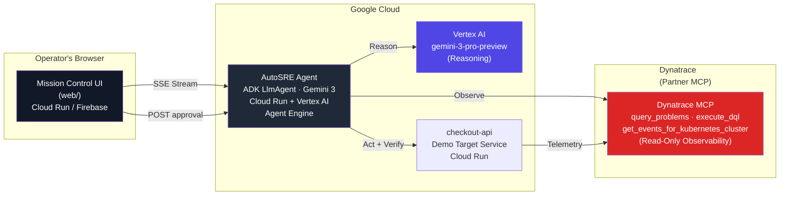

# AutoSRE: autonomous incident response, with you in the loop

**Track: Dynatrace** · Built with **Gemini 3** on **Google Cloud's Agent Platform (Agent Builder)** using the **Agent Development Kit (ADK)** · Deployed to **Vertex AI Agent Engine** · Partner superpower via the **Dynatrace MCP server**.

## The Real-World Problem

Production incidents don't wait. When a checkout service crashes at scale, **every minute of downtime costs money, a lot of it.** Estimates land in the thousands of dollars per minute: Gartner's widely cited figure is **$5,600 per minute** (from a 2014 study), and EMA Research's 2024 analysis puts unplanned downtime at roughly **$14,056 per minute** across organizations. Yet diagnosing the root cause typically takes **30+ minutes** of manual triage by an on-call engineer: opening dashboards, running queries, correlating events, narrowing the blast radius. At those rates, that is six figures of lost revenue *before* the fix even starts.

> Sources: the $5,600/minute figure traces to a 2014 Gartner study, still the most-cited downtime benchmark ([Atlassian](https://www.atlassian.com/incident-management/kpis/cost-of-downtime)); the $14,056/minute figure is from EMA Research's 2024 analysis ([The Network Installers, 2026 roundup](https://thenetworkinstallers.com/blog/cost-of-it-downtime-statistics/)).

**AutoSRE collapses the triage phase to seconds.** It's the autonomous on-call engineer that detects an incident from Dynatrace, diagnoses the root cause from live telemetry, proposes exactly one fix, waits for your one-tap approval, executes it, and verifies recovery. **But it never touches production without your authority.**

---

## Why This Matters

| Problem | Traditional Response | AutoSRE |
|---|---|---|
| **Time to identify root cause** | 30+ minutes (human triage) | seconds — live DQL + Gemini diagnosis (timed on-screen in the demo) |
| **Human fatigue** | 3am wake-ups, hundreds of manual queries | On-call engineer just approves the fix |
| **Safety** | Inconsistent process; remediation errors | Python-enforced approval gate; model cannot bypass |
| **Visibility** | Black-box response | Streaming timeline; operator sees every step live |
| **Trust** | Auto-remediation with no oversight | Human-in-the-loop by design (ADK `require_confirmation`) |

AutoSRE targets **on-call SREs, DevOps teams, and ops platforms** in retail, financial services, and other cost-sensitive domains where incident cost is measured in thousands per minute.

---

## What AutoSRE Does

The agent runs a **6-step loop**, driven by **Gemini 3 reasoning on Google Cloud's Agent Platform**:

1. **DETECT**: List open problems from Dynatrace (anomalies, threshold violations, deployment events).
2. **DIAGNOSE**: Run DQL queries to correlate the problem with recent changes (deploys, feature flags, configuration).
3. **PROPOSE**: Reason about the root cause and name exactly one remediation (disable flag, rollback, scale service).
4. **PAUSE**: Stream the proposed action to the web UI and block until a human approves.
5. **ACT**: Execute the approved remediation.
6. **VERIFY**: Re-query Dynatrace to confirm the open problem has cleared, then re-check the target service's health. Dynatrace both opens the incident and confirms recovery, so it bookends the loop.

The web "Mission Control" UI streams this loop live. The operator watches the agent pull the problem card, run evidence queries, propose the fix, and then **taps Approve** to execute. The incident card flips green when recovery is verified.

---

## Architecture



**Key architectural points:**

- **Agent:** An ADK `LlmAgent` on `gemini-3-pro-preview` via **Vertex AI**, registered on **Vertex AI Agent Engine** (Google Cloud's managed Agent Platform runtime). Runs the 6-step loop.
- **Dynatrace MCP (the agent's senses):** The agent's **only** observability source. Detection, diagnosis, and recovery confirmation run on Dynatrace tools (`query_problems`, `execute_dql`, `get_events_for_kubernetes_cluster`). Tool names use underscores because Gemini's function-calling requires them; the toolset also accepts a real gateway's hyphenated names. The Dynatrace MCP is **load-bearing**: the agent cannot reason without it.
- **Human-in-the-loop:** ADK-native `FunctionTool(require_confirmation=True)` enforces the approval gate in Python. The model cannot bypass it.
- **Web Mission Control UI:** A Next.js dashboard that streams the loop over SSE and renders the **APPROVE / REJECT** moment as a blocking modal. This is the "web" platform requirement.
- **Three swappable Dynatrace backends** (agent code unchanged):
  - **`mock`**: offline bundled server; demo with zero accounts.
  - **`stdio`**: official `npx @dynatrace-oss/dynatrace-mcp-server` locally.
  - **`remote`**: your Dynatrace tenant's hosted MCP gateway (HTTP + token).

---

## Key Design Decisions

### Framework-Enforced Human-in-the-Loop

The approval gate is **not** a prompt instruction the model might ignore. It's an ADK-native `FunctionTool(require_confirmation=True)` that blocks execution in Python before the tool runs. The model sees the tool definition but cannot call it without explicit human approval. This is stronger than a prompt.

### Mode-Agnostic Guarantee

The agent core is **identical** across `DYNATRACE_MCP_MODE=mock | stdio | remote`. The tool names, response formats, and streaming events are byte-identical in all three modes. The UI, the streaming contract, and every integration never branch on mode. For the demo, you can run detect/diagnose against a **real Dynatrace trial tenant** (for credibility) and act/verify in `mock` mode (for reliability). Both are the same agent, just different env settings.

### Streaming Visibility

Every step streams to the web UI over SSE: tool calls, results, reasoning chunks, and the approval moment. The operator *sees* the agent work in real time. This is the "visible autonomy" that makes the moment credible.

---

## Quickstart (Fully Offline, No Accounts Needed)

```bash
# 1. Set up the Python environment
python3 -m venv .venv
source .venv/bin/activate
pip install -r requirements.txt

# 2. Copy the example environment (defaults to mock Dynatrace)
cp .env.example .env
# Add GOOGLE_API_KEY=... (free from Google AI Studio, no GCP billing needed)

# 3. Start the target service in one terminal
python -m autosre.target_service.main
# Serves on http://127.0.0.1:8081
# Check health: curl http://127.0.0.1:8081/healthz

# 4. In a second terminal, inject a fault
curl -X POST http://127.0.0.1:8081/_admin/inject \
     -H 'content-type: application/json' \
     -d '{"fault":"payment_errors"}'

# 5. In a third terminal, run the agent
python -m autosre.run_agent
```

Watch the agent:
- Pull the problem from mock Dynatrace ("checkout failure rate spiked after deploy v2.3.1").
- Run DQL to find the culprit (feature flag `new_payment_gateway` is enabled).
- Propose disabling the flag.
- Pause and ask for your approval (`HUMAN APPROVAL REQUIRED`).
- Execute it (type `y`).
- Verify the service is healthy again.

**Available faults:**
- `payment_errors`: failure rate spikes to 22%; correct fix: disable `new_payment_gateway` flag or rollback to v2.3.0.
- `latency_spike`: p99 latency jumps to 4200ms; correct fix: scale replicas to 8+.

### With the Web UI (Mission Control)

```bash
# From the repo root (so .env is loaded):
python -m autosre.server           # Start the SSE backend on :8080
# In another terminal:
cd web && npm install && npm run dev  # Next.js dev server on :3000
```

Open http://127.0.0.1:3000 in your browser. Click **"Run Incident Sweep"**, optionally select a fault to inject, and watch the agent stream its reasoning and the timeline. When it proposes a fix, an **APPROVE / REJECT** modal blocks until you decide. The incident card flips green on recovery.

Or use the demo launcher:

```bash
bash scripts/start_demo.sh
```

This boots the target service, the SSE backend, and the web UI all at once.

> **Reliability note:** On the free AI Studio tier, `gemini-3-flash-preview` allows ~5 requests/minute, so a full local loop backs off and resumes on rate limits (slower, but it completes). The deployed submission runs Gemini 3 on **Vertex AI**, which does not have that constraint. For a hosted demo URL that can never stall on a model blip, set `AUTOSRE_DEMO_MODE=1`: the loop replays deterministically with no model call while still applying the real fix, so recovery stays genuine.

---

## Run Against Real Dynatrace

To demo against your Dynatrace tenant instead of the mock:

1. **Create a trial tenant** at https://www.dynatrace.com/trial/ (free, 15 days).
2. **Generate a Platform token** with these scopes:
   - `mcp-gateway:servers:invoke`
   - `mcp-gateway:servers:read`
   - `storage:logs:read`, `storage:metrics:read`, `storage:events:read`
3. **Update `.env`:**
   ```bash
   DYNATRACE_MCP_MODE=remote
   DT_ENVIRONMENT=https://YOUR-TENANT.apps.dynatrace.com
   DT_PLATFORM_TOKEN=dt0s16...
   ```
4. **Run the agent as above.** It will now detect and diagnose against your real tenant.

To use the official local Dynatrace MCP server instead of the hosted gateway:

```bash
DYNATRACE_MCP_MODE=stdio
DT_ENVIRONMENT=https://YOUR-TENANT.apps.dynatrace.com
DT_PLATFORM_TOKEN=dt0s16...
# Requires Node.js / npx
```

---

## Deploy to Google Cloud

```bash
export PROJECT_ID=your-gcp-project
export REGION=us-central1
export DT_ENVIRONMENT=https://YOUR-TENANT.apps.dynatrace.com
export DT_PLATFORM_TOKEN=dt0s16...
bash deploy/deploy_cloud_run.sh
```

This script:
- Builds and deploys `checkout-api` to Cloud Run.
- Builds and deploys the AutoSRE agent to Cloud Run and registers it on **Vertex AI Agent Engine**.
- Builds and deploys the `web/` Mission Control UI to Cloud Run (or Firebase Hosting).
- Wires the agent's `ALLOWED_ORIGIN` to the deployed UI.
- Outputs the live public URL.

The final URL is your submission to judges (Devpost requirement: must work from an incognito window).

---

## Tests

```bash
pytest
```

Runs 30 tests: 28 offline-deterministic, plus 2 gated on live Gemini credentials.
- **Machinery tests (deterministic):** Mock Dynatrace server over MCP stdio protocol; verify the approval gate, remediation execution, and incident outcome for both fault types.
- **Integration tests:** Live SSE streaming from the backend; approval round-trip; full agent loop with real Gemini (skipped unless Gemini credentials present).
- **MCP envelope parsing:** Regression tests for real ADK tool response unwrapping (fixed a critical bug).
- **Demo mode (`test_demo_mode.py`):** a deterministic replay exercises the full detect→verify loop and applies the **real** remediation HTTP call, so the hosted demo stays reliable even if the model API is briefly unavailable. The model-driven loop itself is covered by the live agent test and proven in the demo video (real Gemini + real DQL against the tenant).

The 28 deterministic tests pass offline (mock Dynatrace). The 2 live tests run against Gemini if credentials are present.

---

## Repository Layout

```
autosre/
├── agent/
│   ├── agent.py              # ADK LlmAgent + mode-aware prompt (detect→diagnose→act→verify)
│   ├── dynatrace.py          # Dynatrace MCP toolset builder (mock/stdio/remote)
│   └── remediation.py        # Remediation tools (scale/rollback/flag) the gate wraps
├── server/
│   ├── app.py                # FastAPI HTTP + SSE service
│   ├── loop.py               # ADK loop primitives (shared by run_agent.py + server)
│   ├── events.py             # Event adapter (ADK → CONTRACT.md SSE schema)
│   ├── runs.py               # Per-run session management + pause/resume bridge
│   └── demo.py               # Deterministic replay backing the hosted demo (reliability)
├── mock_dynatrace/
│   └── server.py             # Offline Dynatrace MCP server (snake_case tool names)
├── target_service/
│   ├── main.py               # checkout-api: the demo target (injectable faults)
│   └── otel.py               # Optional real OpenTelemetry export to Dynatrace
└── run_agent.py              # Interactive CLI runner (offline demo entry)
web/
├── app/
│   ├── page.tsx              # Landing page
│   ├── demo/page.tsx         # Mission Control (the live demo)
│   ├── api/
│   │   ├── incident/         # start · [runId]/stream · [runId]/approval (→ agent)
│   │   └── demo/             # inject · health · reset
│   ├── globals.css           # Tailwind v4 + design tokens
│   └── layout.tsx
├── components/
│   ├── approval-modal/ApprovalModal.tsx   # APPROVE / REJECT blocking modal
│   ├── timeline/Timeline.tsx              # Phase-progress streaming timeline
│   ├── dql-panel/DqlPanel.tsx             # DQL evidence panel
│   ├── problem-card/ProblemCard.tsx       # Dynatrace problem display
│   ├── demo-controls/DemoControls.tsx     # Fault-injection controls
│   ├── landing/              # CountUp · FlowDiagram · NavLinks · ScrollProgress · ScrollReveal
│   └── ui/                   # Badge · FinalReport · Panel
├── hooks/useIncidentStream.ts             # SSE client hook
├── lib/                      # api.ts · types.ts
├── Dockerfile                # Next.js standalone image
└── cloudbuild.yaml           # UI image build (Cloud Build)
deploy/
├── Dockerfile.agent          # Builds the agent (SSE backend, Vertex AI)
├── Dockerfile.target         # Builds checkout-api
├── cloudbuild.svc.yaml       # Generic Cloud Build (-f path) for the Python services
└── deploy_cloud_run.sh       # Orchestrates the three deployments
tests/
├── conftest.py                     # Boots checkout-api for the suite
├── test_remediation_gate.py        # Approval gate enforcement
├── test_mock_dynatrace.py          # Mock Dynatrace MCP tool shapes
├── test_server_sse.py              # Full-loop SSE streaming + contract
├── test_demo_mode.py               # Deterministic demo replay
├── test_mcp_envelope_parsing.py    # Real ADK result unwrapping
└── test_agent_live.py              # End-to-end with real Gemini (live-gated)
.env.example                  # Environment variable template
.env                          # (gitignored) Runtime secrets
README.md                     # This file
ARCHITECTURE.md               # Deploy topology
CONTRACT.md                   # Agent ↔ UI streaming interface
DEMO.md                       # Demo runbook
VIDEO-SCRIPT.md               # Video script (≤3:00, criterion-tagged)
SUBMISSION.md                 # Devpost requirement → evidence checklist
DECISION-LOG.md               # Build decision log
DEVPOST.md                    # Devpost form draft
LICENSE                       # MIT
```

---

## How It Wins

**Technological Implementation (25%)**
- Gemini 3 reasoning on Google Cloud's **Agent Platform (ADK)**, deployable to **Vertex AI Agent Engine**.
- Dynatrace MCP is the **only** sensory system (load-bearing, not ornamental).
- ADK-native human-in-the-loop (`require_confirmation=True`): framework-enforced, not prompt-hackable.
- Mode-agnostic: works offline (mock), locally (stdio), or against a real tenant (remote), all with identical agent code.

**Design (25%)**
- Dark ops war-room aesthetic ("Mission Control" UI).
- Streaming timeline reveals the agent's reasoning in real time (visible autonomy).
- Hero **APPROVE / REJECT** modal shows the exact action before it runs.
- Recovery state animates the incident card to green.
- Responsive: works on desktop, tablet, and mobile.

**Potential Impact (25%)**
- Addresses a **quantified real-world pain**: Gartner pegs IT downtime at $5,600/minute; MTTR is dominated by the identify phase (30+ min). AutoSRE collapses that to seconds.
- Targets high-value users: on-call SREs, DevOps, retail/financial ops.
- Deployment path clear: Cloud Run + Vertex AI Agent Engine (no custom infrastructure).
- Dynatrace integration is built in (no manual setup of separate observability).

**Quality of the Idea (25%)**
- Sharp, differentiated framing: **"Autonomous, but on your authority."** Not a chatbot (chat is read-only). Not reckless auto-remediation (humans decide). Not a cargo-cult AI addition (the MCP is central).
- Solves a real SRE problem: incident response at scale, with accountability.
- Generalizable: the same loop applies to any incident type; the demo shows two (flag, latency).

---

## Troubleshooting

**Q: The agent times out or rate-limits.**
A: You're hitting Gemini's free-tier quota (~5 req/min). Get a free API key from [Google AI Studio](https://aistudio.google.com) and put it in `.env` (no billing needed yet). If you enable billing on your GCP project, you can use `AUTOSRE_MODEL=gemini-3-pro-preview` for faster reasoning and higher quota.

**Q: The web UI shows "Connection refused" when I click "Run Incident Sweep".**
A: Make sure the SSE backend is running (`python -m autosre.server`) and listening on the port the UI expects. By default, the UI looks for `localhost:8080`; set `NEXT_PUBLIC_AGENT_BASE_URL=http://127.0.0.1:8080` in `.env.local` in the `web/` directory if the backend is on a different port.

**Q: I want to test against a real Dynatrace tenant but don't see any problems.**
A: The `checkout-api` service must be running and injected with a fault first — the agent only reports a problem when one exists. In **mock** mode the bundled Dynatrace MCP surfaces the incident as soon as you inject a fault; against a **real** tenant the live path detects on a `timeseries avg(checkout.failure_rate)` DQL, so allow ~1-2 minutes for OpenTelemetry ingestion before the spike shows. Inject with: `curl -X POST localhost:8081/_admin/inject -H 'content-type: application/json' -d '{"fault":"payment_errors"}'`.

**Q: The approval modal never appears.**
A: The agent may not be reaching the remediation step. Check the timeline in the UI. If it stops at DIAGNOSE, the agent may not have reasoned its way to a fix (wrong model, bad DQL results, or timeout). Check the agent logs for errors. If a remediation tool was called, ensure the `FunctionTool(require_confirmation=True)` is in place in `autosre/agent/remediation.py` (it should be; don't remove it for testing).

**Q: The incident card never turns green even after I approve.**
A: The VERIFY step reads the service's `/_internal/state` endpoint. Ensure the remediation actually fixed the fault. For a payment-error fault, disabling the feature flag should work; for latency, scaling to 8+ replicas should work. If the fix runs but the service is still unhealthy, the agent's reasoning about the root cause may have been wrong. Check the DIAGNOSE DQL results in the timeline.

---

## MIT License

See [LICENSE](LICENSE).

---

## Questions or Issues?

Open an issue on GitHub or reach out. This is an active hackathon build; feedback helps.
